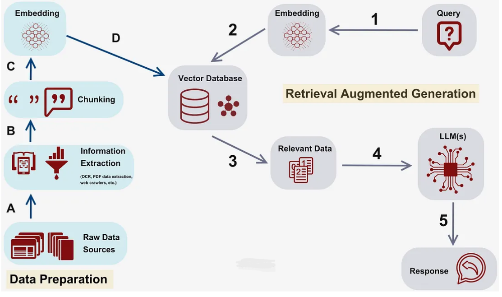

# RAG (Retrieval-Augmented Generation) Project.

A Retrieval-Augmented Generation system is designed to answer questions from financial reports using advanced natural language processing and vector search techniques.

## Overview

This project implements a RAG system that enables intelligent question-answering over financial documents. By combining information retrieval with generative AI, the system can provide accurate, contextually relevant answers to queries about financial reports and data.

RAG enhances Large Language Models (LLMs) by retrieving relevant information from external knowledge sources before generating responses, ensuring answers are grounded in actual data rather than relying solely on the model's training data.


## RAG Conceptual Model




## Features

- **Document Processing**: Handles financial reports and extracts meaningful information
- **Semantic Search**: Uses vector embeddings for intelligent document retrieval
- **Question Answering**: Generates accurate answers based on retrieved context
- **Contextual Understanding**: Maintains context across financial documents
- **Scalable Architecture**: Designed to handle large document collections

## User Interface 
- The project includes a Streamlit chatbot UI: 
- Users open a web page 
- Type questions in natural language 
- Get answers with sources and confidence

## Dataset

This project uses the **Financial Reports QA Dataset** from Kaggle:

**Source**: [Data Retriever Dataset by ahmedsta](https://www.kaggle.com/datasets/ahmedsta/data-retreiver)

The dataset contains:
- Financial reports and documents
- Question-answer pairs for training and evaluation
- Structured financial data for RAG applications

### Dataset Setup

1. Download the dataset from the Kaggle link above
2. Place the dataset files in the `data/` directory
3. Ensure the data structure matches the expected format

## Installation

### Prerequisites

- Python 3.8 or higher
- `uv` package manager (recommended) or `pip`
- Virtual environment support

### Setup Instructions

1. **Clone the repository**
   ```bash
   git clone https://github.com/eyasu11321238a/RAG.git
   cd RAG
   ```

2. **Create and activate virtual environment**
   ```bash
   # On Windows
   .venv\Scripts\activate
   
   # On macOS/Linux
   source .venv/bin/activate
   ```

3. **Install dependencies using uv**
   ```bash
   # Install uv if you haven't already
   pip install uv
   
   # Install project dependencies
   uv add -r requirements.txt
   ```

   **Alternative: Using pip**
   ```bash
   pip install -r requirements.txt
   ```
   **Run the Chatbot Application**
   From the project root:

   ```bash
   streamlit run app.py
   ```
  Then open the URL shown in the terminal (usually):
  ```bash
   http://localhost:8501
   ```
## Technologies Used

- **Python 3.8+**: Core programming language
- **LangChain**: RAG framework and orchestration
- **Sentence Transformers**: Text embedding generation
- **FAISS/ChromaDB**: Vector database for similarity search
- **Groq API**: Language model integration (llm model="llama-3.1-8b-instant")
- **Embedding model**: ="all-MiniLM-L6-v2",
- **Streamlit**: For basic UI entry point


## How It Works

1. **Document Ingestion (`data_loader.py`)**
   - Load all supported file types from the `data/` folder: PDF, TXT, CSV, DOCX, Excel, JSON.
   - Normalize metadata such as `source_file` and `page` for consistent handling.
   - Prepare documents for chunking and embedding.

2. **Document Chunking & Embedding (`embedding.py`)**
   - Split documents into smaller chunks using `RecursiveCharacterTextSplitter`.
   - Preserve metadata (`source_file` and `page`) for each chunk.
   - Generate semantic embeddings for each chunk using `SentenceTransformer`.

3. **Vector Store Management (`vectorstore.py`)**
   - Store chunk embeddings and metadata in a FAISS index for fast similarity search.
   - Supports:
     - **Loading existing vector store** to avoid rebuilding on each run.
     - **Adding new documents** incrementally without rebuilding the entire index.

4. **Query Processing (`search.py`)**
   - Embed user queries using the same embedding model.
   - Retrieve the most relevant chunks from FAISS based on similarity.
   - Filter results using a configurable minimum similarity score.

5. **Answer Generation (Groq LLM)**
   - Concatenate retrieved chunks into a single context.
   - Pass context + query to the Groq LLM (`ChatGroq`) for response generation.
   - Outputs include:
     - `answer` – the LLM-generated response
     - `sources` – metadata of retrieved chunks
     - `confidence` – highest similarity score among results
     - Optional `context` preview for reference

### RAG Pipeline Flow

```
User Query → Embedding → Vector Search → Context Retrieval → LLM → Answer
```
